# Daily Email Workflow Design (Johann) — v0.2

**Date:** 2026-05-12
**Status:** Draft for Tim review (rewritten after evaluation pass)
**Author:** Tim Keenan + Claude (Opus 4.7)
**Depends on:** Phase 1 spike GO, Beehiiv API access, Tim's existing email-writing prompts (see §5)
**Scope:** One workflow. Daily email to a defined audience cohort. Approval-gated send. Nothing else.

---

## 0. Why this exists

Tim sends no email today. Beehiiv list is opted-in but dark. The wound is execution: he needs one thing that drafts a good email every weekday in his voice and asks for one click before sending. Everything else is later.

## 1. Scope & success criteria

**Goal:** Every weekday by 9am Pacific, a draft is in `#email-drafts`. One click approves and sends. Edits become the final content. Rejects are logged. Nothing else.

**Success criteria at the 3-week mark:**
- ≥10 emails actually sent (out of ~15 weekday opportunities). Misses are fine; sub-10 is a problem.
- Tim is editing ≤30% of drafts heavily (more than a typo pass). Above that, the prompt isn't earning its keep.
- Unsubscribe rate ≤ 1% per send.
- Spam complaint rate ≤ 0.1%.
- Open rate ≥ 25% on the engaged cohort (see §8).

**Kill conditions at 3 weeks (any one triggers shutdown, not iteration):**
- Unsub rate > 2% sustained.
- Complaint rate > 0.3% on any single send.
- Tim editing every draft from scratch.
- Open rate < 10% on engaged cohort.

**Out of scope for v1:** list segmentation beyond the deliverability cohorts in §8, autonomous send, voice-critique LLM loop, transcript ingestion, engagement-dashboard reporting, multi-channel repost, A/B testing, Rollout B/C planning. All of these are decisions for after v1 has run for 3 weeks.

## 2. Persona

Add to `knowledge/personas.yaml`:

```yaml
johann:
  display: "Johann"
  emoji: ":notes:"
  color: "#7a4e2d"
  bio: "Daily list-email writer. Drafts nurture emails in Tim's voice for human approval before send."
  default_surfaces:
    - slack
    - drafts
```

## 3. Architecture

```
workflows/marketing/
  daily-email.fabro
  daily-email.toml

prompts/marketing/
  draft.md                ← single LLM stage; integrates Tim's existing prompts (§5)

scripts/marketing/
  load_context.sh         ← pulls cohort + voice guide + recent sends into a brief
  lint.sh                 ← deterministic, high-precision phrase blocklist; hard fail only
  save_draft.sh           ← inserts row into email_drafts
  send_approved.sh        ← calls maestro beehiiv send
  finalize_edit.sh        ← writes human.gate.text as final body, then routes to send
  finalize_reject.sh      ← writes human.gate.text as reject reason, exits
  run_summary.sh          ← posts daily run-summary to #maestro-runs
```

Scheduling: Trigger.dev cron in mas-platform calls `POST /api/v1/runs/{id}/start` weekdays at 9am Pacific.

Slack handling: `fabro-slack` crate from Phase 1 Test 1 owns persona overlay + approval-card dispatch. Config in `daily-email.toml` `[run.notifications.slack]` (fork-specific, see §11).

## 4. The workflow DOT

```dot
digraph DailyEmail {
    graph [
        goal="Draft one daily email in Tim's voice and send on human approval.",
        rankdir=LR,
        stall_timeout="14400s",
        model_stylesheet="
            * { provider: openrouter; model: anthropic/claude-sonnet-4-6; reasoning_effort: high; }
        "
    ]

    start [shape=Mdiamond, label="Start"]
    exit  [shape=Msquare, label="Exit"]

    load_context [shape=parallelogram, label="Load Context",
                  script="./scripts/marketing/load_context.sh"]

    draft [shape=tab, label="Draft",
           prompt="@prompts/marketing/draft.md",
           max_tokens=1500]

    lint [shape=parallelogram, label="Lint AI-Tells (hard fail)",
          script="./scripts/marketing/lint.sh"]

    save_draft [shape=parallelogram, label="Save Draft",
                script="./scripts/marketing/save_draft.sh"]

    approval [shape=hexagon, label="Approve Send",
              question_type="multiple_choice",
              "human.default_choice"="reject"]

    finalize_edit   [shape=parallelogram, label="Finalize Edit",
                     script="./scripts/marketing/finalize_edit.sh"]
    finalize_reject [shape=parallelogram, label="Finalize Reject",
                     script="./scripts/marketing/finalize_reject.sh"]
    send            [shape=parallelogram, label="Send via Beehiiv",
                     script="./scripts/marketing/send_approved.sh"]
    run_summary     [shape=parallelogram, label="Run Summary",
                     script="./scripts/marketing/run_summary.sh"]

    start -> load_context -> draft -> lint -> save_draft -> approval

    approval -> send            [label="[A] Approve"]
    approval -> finalize_edit   [label="[E] Edit",   freeform=true]
    approval -> finalize_reject [label="[R] Reject", freeform=true]

    finalize_edit   -> send
    finalize_reject -> run_summary
    send            -> run_summary -> exit
}
```



**Notes on the graph:**

- **No critique-revise loop.** Draft once. Lint once. If lint fails (high-precision blocklist hit), the workflow exits with `failed`; Tim sees the failure in `#maestro-runs` and the prompt is the thing to fix, not the LLM.
- **Edit path writes the user's edit as the final body and routes to `send`.** The LLM does NOT re-run. The human's edit IS the final content. This is the v0.1 bug fixed.
- **No diamond gate, no `context.verdict` routing.** The earlier design's two-edges-to-same-target ambiguity is gone.
- **`stall_timeout="14400s"`** (4 hours) covers a reasonable "Tim is in a meeting" window without leaving stale drafts open all day. Default choice on timeout is reject.
- **Single model tier.** Sonnet 4.6 for the draft; everything else is shell. Add tiered routing only if quality forces it.

## 5. The draft prompt

Tim already has a body of prompts for email writing. **Action item:** Tim points at the canonical source (likely in his `~/.claude/skills/quickstart/knowledge/cold-email-architect.md` or similar) before build. `prompts/marketing/draft.md` integrates that as its base. Treating it as fixed input rather than re-deriving from scratch.

Inputs to the prompt (assembled by `load_context.sh` into a single `context-brief.md`):
- `knowledge/voice.md` — the voice guide
- This week's offer/promotion context (`knowledge/marketing/current_focus.md`, Tim-edited)
- Last 5 sent emails verbatim (avoid repetition; voice anchor)
- Recipient cohort label (see §8) — affects tone
- Today's date and day of week

Output: subject + body in markdown. Hard constraints from voice.md (under 100 words for cold sequences; nurture can be 80-300; lowercase 2-6 word subjects; one CTA; etc. — defer to voice.md as the source of truth, don't restate here).

## 6. Lint (high-precision blocklist only)

`scripts/marketing/lint.sh` — exits non-zero on any hit.

Banned phrases (case-insensitive, near-100% LLM-only):
- `delve into`, `delving`
- `in today's fast-paced`, `in today's digital`
- `navigate the complexities`, `navigating the complexities`
- `hope this finds you well`
- `unlock the power of`, `harness the power of`
- `embark on`, `embark upon`
- `in the realm of`, `in the world of`
- `it's important to note that`, `it's worth noting that`
- `cutting-edge`, `state-of-the-art`, `AI-powered`, `AI-driven`

That's it. No structural checks (em-dash density, parallel lists). No banning of "leverage" / "moreover" / "furthermore" — those false-positive on real writing. We're catching the unmistakable LLM-only tells; subtler voice work happens through Tim's editing in Slack and updates to the draft prompt.

## 7. CLI verbs (minimum)

### `maestro beehiiv send`

```
maestro beehiiv send \
  --draft-id <uuid> \
  --cohort <engaged-90d|engaged-180d|all> \
  --subject "<subject>" \
  --body-md <path> \
  --idempotency-key <YYYY-MM-DD-<cohort>>
```

- Reads `BEEHIIV_API_KEY` + `BEEHIIV_PUBLICATION_ID` from env.
- Resolves cohort to a Beehiiv segment ID (one-time setup, see §8).
- Posts to Beehiiv and triggers send.
- Idempotency: same key returns the first result.
- Exit codes: 0 success, 1 validation, 2 API failure.

### `maestro drafts save`

```
maestro drafts save \
  --workflow daily-email \
  --persona johann \
  --subject "<...>" \
  --body-md <path>
```

Returns `{ "draft_id": "<uuid>", "status": "pending_approval" }`. That's it.

No separate `capture-edit` CLI. `finalize_edit.sh` does the work inline:
```bash
maestro drafts update \
  --draft-id $DRAFT_ID \
  --set-body-from $EDITED_BODY_PATH \
  --set-status approved
maestro memory append persona/johann/episodic < edit_event.json
```

Same for reject. Keep the surface area small.

## 8. Deliverability & audience

The Beehiiv list has been dark. Sending daily to a cold list from day 1 will:
- Land in spam (low engagement, no recent sends from the domain → reputation drop)
- Generate unsub spikes from people who forgot they opted in
- Trigger Beehiiv to throttle the sender

**The plan:**

**Week 0 (before any daily sends):** Tim sends ONE first-touch email manually (not through Johann) that:
- Acknowledges the silence
- Explains what's coming (daily-ish operator-to-operator notes)
- Has a clear unsub link at the top, not the bottom
- Asks engaged readers to reply with one word so they're flagged as warm

**Week 1-2 (deliverability ramp):**
- Cohort: **engaged-90d** — anyone who opened or clicked in the last 90 days. Configure as a Beehiiv segment.
- Send daily.
- Monitor opens / unsubs / complaints / replies.

**Week 3+ (if metrics hold):**
- Expand cohort to **engaged-180d**.
- Re-evaluate at end of week 3 against the success/kill criteria in §1.

**Week 6+ (if still healthy):**
- Consider expanding to `all`. Decision, not automatic.

Cohort label is an input to the draft prompt — tone can shift slightly for the warmer-vs-broader audience. `current_focus.md` and the cohort together drive the angle.

## 9. State (minimum)

One migration. One table.

```sql
CREATE TABLE email_drafts (
  id UUID PRIMARY KEY DEFAULT gen_random_uuid(),
  workflow_run_id UUID NOT NULL,
  persona TEXT NOT NULL,
  cohort TEXT NOT NULL,
  subject TEXT NOT NULL,
  body_md TEXT NOT NULL,
  status TEXT NOT NULL,  -- pending_approval | approved | rejected | sent
  rejected_reason TEXT,
  slack_msg_ts TEXT,
  beehiiv_post_id TEXT,
  created_at TIMESTAMPTZ NOT NULL DEFAULT now(),
  sent_at TIMESTAMPTZ
);

CREATE INDEX idx_email_drafts_status ON email_drafts(status, created_at DESC);
```

No `voice_corrections` table. Edit events are captured as memory events in `persona/johann/episodic`:

```json
{
  "event": "edited",
  "draft_id": "...",
  "before_body_md": "...",
  "after_body_md": "...",
  "ts": "..."
}
```

Same for `sent` and `rejected`. One namespace, append-only.

## 10. Build sequence (post Phase 1 GO)

Honest estimate: **5-7 working days.**

**Day 1:** Add Johann to `personas.yaml`. Write migration. Write `maestro beehiiv send`, `maestro drafts save`, `maestro drafts update` CLI verbs with tests. Configure Beehiiv segments for the cohorts.

**Day 2:** Write `lint.sh` (regex blocklist + unit tests). Write `load_context.sh`. Write `save_draft.sh`, `finalize_edit.sh`, `finalize_reject.sh`, `send_approved.sh`, `run_summary.sh`. Each gets a smoke test.

**Day 3:** Integrate Tim's existing email-writing prompts into `prompts/marketing/draft.md`. Hand-author `daily-email.fabro` + `daily-email.toml`. Manual run on a hardcoded context. Iterate the draft prompt until 3 consecutive runs produce something Tim would approve.

**Day 4:** Set up Promptfoo evals — minimum 5 Tim-written emails + 5 LLM-generic emails. The draft prompt should produce output the lint passes 95%+ on Tim-style inputs and obviously feel Tim-like on a human read. Block deploy if these evals don't pass.

**Day 5:** Tim sends the manual Week 0 first-touch email (this is a manual send, not Johann's first run). Wait 24h for reply signal / unsub baseline before continuing.

**Day 6:** Wire the Trigger.dev cron. First Johann send to engaged-90d cohort. Tim approves live. Watch metrics.

**Day 7:** Tune draft prompt based on Tim's edits. Buffer for any of the above slipping.

Then it's running. Week 3 review against success / kill conditions in §1.

## 11. Dependencies

Cannot ship until:

1. **Phase 1 spike GO.** Slack STOP gate + persona overlay + Socket Mode button → run-resume working.
2. **fabro-slack persona/channel config** — exact `[run.notifications.slack]` key names from the fork's source.
3. **Beehiiv segments configured** for `engaged-90d`, `engaged-180d`, `all`.
4. **Beehiiv API credentials** in env + Daytona snapshot.
5. **OpenRouter access** for Sonnet 4.6.
6. **Tim points at his existing prompts** so they integrate into `draft.md`.
7. **`knowledge/voice.md`** — current draft v0.1 is enough; iterate as edits accumulate.

Not blocking the spike itself.

## 12. Failure modes

1. **Tim ignores the approval card.** `stall_timeout="14400s"` + `human.default_choice="reject"` → workflow self-cancels after 4h, logged. Drafts don't accumulate.
2. **Beehiiv API fails.** `send` command node returns failed; workflow posts failure under Johann to `#maestro-runs`. Manual retry tomorrow. If failures repeat 3 days, kill the cron and investigate.
3. **Two runs in flight.** Idempotency key on `YYYY-MM-DD-<cohort>` prevents double-send. `save_draft` and `beehiiv send` both check it.
4. **Lint false-positive on legitimate Tim text.** Blocklist is intentionally tiny (high-precision). If it triggers on real Tim writing, the response is to tighten/remove the offending entry, not to add a revise loop.
5. **Cohort empty / very small.** `load_context.sh` checks cohort size; if < 50 recipients, posts a warning to `#maestro-runs` and continues — the issue is the segment config, not the workflow.
6. **First-touch warmup got bad metrics.** Don't start Johann until the manual Week 0 email returns acceptable open / unsub rates (>20% open, <2% unsub on engaged-90d). This is a manual gate, not in the workflow.

## 13. Open questions

- **Tim's existing prompts** — where do they live? Confirm path so `draft.md` integrates them rather than diverging.
- **Beehiiv segmentation** — does the current Beehiiv account support segments by engagement window? If not, day 1 work expands to set that up. Verify before Day 1.
- **Approval modal UX** — fork-specific. `freeform=true` per the docs captures text; whether that renders as a Slack modal or inline prompt is fabro-slack's call. Either works.
- **Per-gate timeout** — 4h is a starting heuristic; tune after week 1.
- **Send time** — 9am Pacific. Tim's audience timezone unknown. Don't optimize before there's data.

## 14. Fabro semantics (validated against docs)

Stock Fabro confirmed working:
- Shapes: `Mdiamond`, `Msquare`, `tab`, `parallelogram`, `hexagon`.
- Graph attrs: `goal`, `rankdir`, `model_stylesheet`, `stall_timeout`.
- Node attrs: `prompt` (with `@file.md`), `script`, `class`, `max_tokens`, `question_type`, `human.default_choice`.
- Edge attrs: `label`, `freeform`.
- Edge label `[A] Approve` accelerator format for human gates.
- `freeform=true` edge captures text into `human.gate.text`.

Fork-specific (validate during build):
- Cron / scheduling (rejected; external Trigger.dev cron).
- `[run.notifications.slack]` block in run.toml.
- Persona binding for approval-gate posts.
- Slack modal-with-text-input on `freeform=true`.

---

**End of spec.** Next step: Tim reviews. After approval, transition to `superpowers:writing-plans`.
