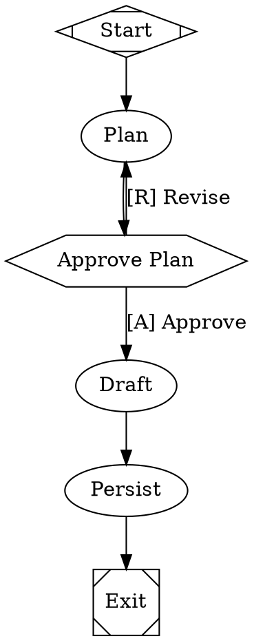
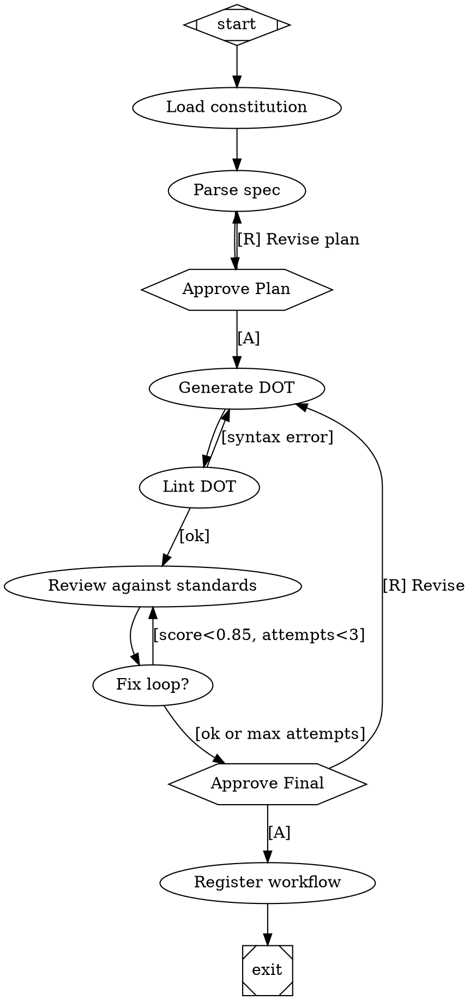

# Maestro-OS Spike Plan

**Date:** 2026-05-12
**Version:** v1.1 (post-evaluation revisions)
**Author:** Tim Keenan + Claude (Opus 4.7)
**Status:** Ready to execute. Hand to Codex.
**Format:** Self-contained — no outside conversation context needed.

---

## 0. Context

Tim is rebuilding his GTM + internal software stack from scratch as an agent-driven operating system called **Maestro**. The current `mas-platform` monorepo (Next.js + Supabase + Trigger.dev, ~6 apps) remains operational; this is a greenfield parallel build, not a migration.

The new system has two primary use cases sharing one runtime:

- **GTM workflows** — lead enrichment, outreach drafting, reply triage, content drafting
- **Software factory** — code planning, implementation, review, testing, merging

Both run as **pipeline-shaped workflows** with deterministic stages, LLM stages, human-approval gates, and explicit validation at every meaningful step. Agents are **personas attached to workflows** (briefed at invocation, not always-on chat partners). Memory is **externalized** to Postgres, accessed via CLI, not resident in the runtime.

The chosen runtime is **Fabro** (https://github.com/fabro-sh/fabro, MIT, Rust). The fork is `modernagencysales/fabro-maestro`. Tim has met the founder; the architecture is well-regarded.

**ADR-003 in `mas-platform/ADR-003-gas-city-architecture.md` was an earlier exploration of Gas City as a coding-agent runtime. This spike plan supersedes ADR-003. Gas City is the wrong shape for this rebuild (tmux/worktree-shaped coding swarm; not built for GTM workflows). The all-Fabro decision was made because (a) memory can live outside the runtime in Postgres via CLI, neutralizing Mastra's main advantage, and (b) compound-leverage benefits of one runtime outweigh the Rust modification cost.**

This spike validates that decision in two phases. **Phase 1 is a hard go/no-go on Fabro itself.** Phase 2 (only if Phase 1 passes) builds the foundation and tests the meta-loop (Fabro generating Fabro workflows from specs).

**Total spike effort: 10–12 working days.** Phase 1 caps at 4 days; Phase 2 caps at 7 days.

---

## 1. Architecture Overview

```
┌─────────────────────────────────────────────────────────────────┐
│                       Slack workspace                            │
│                  (DMs, channels, mentions, buttons)              │
└──────────────────────────────┬──────────────────────────────────┘
                               │ Socket Mode (inbound)
                               │ chat.postMessage / chat.update (outbound)
                  ┌────────────▼────────────┐
                  │       Fabro (Rust fork) │
                  │   - DOT workflows       │
                  │   - HITL gates          │
                  │   - Daytona sandboxes   │
                  │   - Git checkpoints     │
                  │   - Multi-model         │
                  │     stylesheets         │
                  │   - fabro-slack crate   │
                  │     handles Slack I/O   │
                  └────┬───────────────┬────┘
                       │ shell         │ HTTP (one exception)
                       │               │
            ┌──────────▼────┐    ┌────▼──────────────┐
            │  maestro CLI  │    │ Playwright MCP    │
            │  (Bun-comp.)  │    │ (browser only)    │
            └──────────┬────┘    └───────────────────┘
                       │
                       ▼
            ┌──────────────────────────────────────┐
            │   Neon Postgres (+pgvector)          │
            │   - runs, events, gates              │
            │   - leads, drafts, campaigns         │
            │   - agent memory                     │
            │     (persona/team/run namespaces)    │
            │   - knowledge index                  │
            │   - cli_invocations                  │
            │   - eval_runs, eval_outcomes         │
            └──────────────────────────────────────┘
```

**Slack inbound/outbound clarification:**
- **Inbound** (button clicks, DMs, slash commands, mentions): rides existing **Socket Mode** connection in the `fabro-slack` crate. **Do not add a public webhook endpoint.** Socket Mode is already established for interview Q&A; we extend it for approval-card buttons.
- **Outbound** (status updates, approval cards, persona posts): uses `chat.postMessage` for new messages and `chat.update` for editing existing thread messages. Long-running stages edit a single anchor message rather than spamming the thread.

**Key architectural decisions:**

| Decision | Rationale |
|---|---|
| Single runtime (Fabro) | Compound benefits of one debugging surface, one observability stack, one mental model. Mastra was rejected because externalized memory neutralizes its advantage. |
| All workflows in DOT graphs | Diffable, version-controllable, visual specifications that happen to execute. Better than TS for "encode the methodology" goal. |
| CLI > MCP for tool surface | MCP is out of fashion; CLI composes via Unix pipes; agents already know shell. Playwright is the one MCP exception (browser state). |
| `maestro` single binary in Bun-TS | Single binary deploys; TS so business logic can be shared; ~80ms startup acceptable. Pin Bun version `1.2.x` for spike. |
| Neon, not Supabase | Greenfield; branching is genuinely useful for AI-driven dev; serverless economics; no need for Supabase's auth/storage/realtime. |
| Externalized memory | `maestro memory get/append/load-brief` accessing Postgres + pgvector, with cortex-mem as the leading sidecar candidate if its MCP/REST memory layer proves better. Auditable, runtime-agnostic, swappable. |
| Personas, not persistent agents | Each workflow run loads its brief from memory + knowledge files. No always-on agent processes. |
| Subscription CLIs (Claude/Codex) | Cost arbitrage via `claude` Pro/Max and `codex` ChatGPT subscriptions inside Daytona sandboxes; OpenRouter for non-CLI work. |
| Rig for generated Rust AI apps | Fabro remains the factory/runtime. Rig is an output app framework candidate for AI apps the factory builds: agents, RAG, embeddings, vector stores, and lightweight pipelines. |
| Promptfoo (no wrapper) for evals | Direct use; build `maestro eval` wrapper only if needed in v1. |

**What this is NOT:**

- Not a customer product (Relevance/Lindy clone)
- Not chatty multi-agent (no `@email-agent` mentions; manager owns user-facing conversation)
- Not multi-tenant
- Not migrating `mas-platform` first
- Not building a Rust frontend (any UI = React + Shadcn + Tailwind, later)

---

## 2. Phase 1: Fabro Go/No-Go (4 days, hard cap)

**Goal:** confident go/no-go decision on Fabro as the runtime, before committing to Phase 2 foundation work.

### Why the caps matter

The 4-day cap is the test, not just a schedule constraint. Phase 1 is measuring the **modification surface cost** of the fork. If the Rust changes take significantly longer than the cap, that *is* the answer: maintaining a fork at this churn rate is too expensive. **Hitting the cap with incomplete work is data, not failure.** Do not extend Phase 1 to "ship" the Rust work — declare the result and decide.

### The 5 Tests

#### Test 1: Rust modification surface stays bounded

The hardest Rust change is the Slack approval-gate dispatch (extending the existing `fabro-slack` crate, which currently handles interview Q&A but not approval-gate notifications).

Tasks:
- Add OpenRouter as a Provider variant. Reuse existing `OpenAiCompatible` adapter logic. Approx 150 LOC.
- Build Slack notification + approval-gate dispatch:
  - Listen to `run.blocked` events; post an approval card with Approve/Reject/Edit buttons
  - Listen to stage-completion events; **update existing thread message via `chat.update`** (not new post)
  - Add new REST endpoint `POST /api/v1/runs/{id}/gates/{gate_id}/decision`
  - Handle `chat:write.customize` for persona overlays
  - Extend Socket Mode interaction handler in `fabro-slack/src/interaction.rs` to parse block-action callbacks
  - Approx 500–800 LOC

**Pass:** Both changes merged into fork. Total time ≤ 3 days with Tim+Claude pair-coding the Rust (Codex alone unlikely to be enough).
**Fail:** >3 days of Rust work to get a working approval gate.

#### Test 2: A real workflow runs end-to-end through Slack

Hand-author one DOT file that exercises the full stack:



This must validate:
- Persona post via `chat.postMessage` overlay
- Approval button click → Socket Mode interaction → resume workflow (the dispatch we built in Test 1)
- Stage progress streamed via `chat.update` to the same thread
- Claude CLI subscription auth inside Daytona sandbox
- OpenRouter for non-CLI stages
- Shell `command` stage executing CLI tool

**Pass:** All 6 pieces work. End-to-end run completes in <5 minutes wall time.
**Fail:** Any one piece is fundamentally broken (no workaround).

#### Test 3: Subscription CLI auth in Daytona

The unverified question. Procedure:

```bash
# Step 1: Build a Daytona snapshot that includes Claude + Codex auth state
# Create snapshot definition at sandbox/snapshot.toml:
[snapshot]
name = "maestro-dev"
base = "ubuntu:24.04"

[files]
# Mount host auth dirs into snapshot. Verify these paths exist on Tim's machine first.
"~/.claude/" = "/root/.claude/"
"~/.codex/" = "/root/.codex/"

[install]
commands = [
  "curl -fsSL https://claude.ai/install.sh | sh",
  "npm install -g @openai/codex-cli",
  "apt-get install -y jq curl git"
]

# Step 2: Spin up a sandbox from this snapshot
# Step 3: Inside the sandbox:
claude --version
claude -p "say hello"
codex --version
codex run -p "say hello"
```

**Pass:** Both CLIs work with subscription auth (no API key prompts).
**Partial pass:** Works only with the snapshot-copy approach above (acceptable; document as the canonical pattern).
**Fail:** Neither works even with mounting. Cost arbitrage thesis breaks; fall back to API + key for everything.

**INVESTIGATE Day 0:** the exact Daytona snapshot TOML syntax. The example above is a sketch; verify against Daytona's current docs and adjust before running the test.

#### Test 4: Iteration loop speed

From "edit DOT file" to "see result in Slack":

- Edit a stage prompt
- Trigger the workflow (`fabro run <name>`)
- Measure: edit → first stage output visible in Slack

**Pass:** Under 60 seconds for a small workflow.
**Fail:** Over 2 minutes. Iteration friction will kill velocity.

#### Test 5: Sub-workflow invocation

Does one workflow call another cleanly?

- Build a 1-stage wrapper workflow that invokes the Test 2 workflow as its body
- Verify result data flows back to the parent

Two paths to test:
- **First-class:** check if Fabro has a `subflow` handler already. Inspect `lib/crates/fabro-workflow/src/handler/mod.rs` for it.
- **Command-stage shim:** if no first-class subflow, use a `command` stage: `fabro run inner --wait --output - --input "$INPUT_JSON" | jq -r '.output'`.

**Pass:** At least one path works reliably (first-class preferred; command-stage shim acceptable for spike).
**Fail:** Neither path works (workflows can't compose).

### Phase 1 Decision Matrix

| Test | Pass | Partial | Fail |
|---|---|---|---|
| 1 (Rust surface) | GO | n/a | NO-GO (fork too expensive) |
| 2 (E2E workflow) | GO | n/a | NO-GO (architecture broken) |
| 3 (Subscription CLI) | GO | CONDITIONAL GO with documented pattern | CONDITIONAL GO with API+key fallback (more expensive but works) |
| 4 (Iteration speed) | GO | CONDITIONAL GO with "investigate in v1" | NO-GO if extreme (>5 min) |
| 5 (Sub-workflow) | GO | CONDITIONAL GO with command-stage pattern | NO-GO |

**Overall decision:**
- **GO** if all 5 are Pass
- **CONDITIONAL GO** if Tests 1, 2, 5 are Pass and Tests 3, 4 are at worst Partial
- **NO-GO** if any of Tests 1, 2, 5 is Fail, or if Tests 3 or 4 are catastrophic Fail

---

## 3. Phase 1 Execution Plan

### Human checkpoints (Codex must stop and wait for Tim at each)

- **End of Day 0:** Tim reviews setup outputs (subscription CLI auth pattern works, Slack app installed, Fabro builds). Authorizes start of Rust work.
- **Midway Day 2:** Tim reviews OpenRouter + Slack post (outbound) demos. Authorizes the inbound dispatch work.
- **End of Day 3:** Tim reviews Test 2 E2E run recording. Authorizes Tests 4 + 5 on Day 4.
- **End of Day 4:** Tim reviews Phase 1 findings doc. Authorizes (or doesn't) Phase 2.

### Day 0 (~6 hrs) — Setup

**Codex cannot complete this day fully autonomously.** Browser wizards and account setups need Tim's hands. Codex should prepare what it can and hand off to Tim for the interactive bits.

**Output:** Local Fabro builds, Slack app installed, Neon project created, Daytona working, subscription-CLI auth question answered.

1. Clone the fork: `gh repo clone modernagencysales/fabro-maestro` (target: `/Users/timlife/Documents/claude code/fabro-maestro/` — **sibling of `maestro-os/`, not nested inside**)
2. Build it locally: `cargo build --release` (expect 5–10 min cold)
3. **Tim runs**: `fabro server start` — completes the browser wizard manually. Codex cannot complete this step.
4. **Tim creates Neon project** (free tier) via Neon dashboard. Enables branching. Provides the `DATABASE_URL` connection string to add to `.env.local`.
5. **Tim creates Slack app** (one app, Socket Mode on) via Slack dashboard. Scopes required:
   - `chat:write`
   - `chat:write.customize` (persona overlay — critical)
   - `app_mentions:read`
   - `im:history`, `im:read`, `im:write`
   - `channels:history`, `channels:read`
   - `commands` (slash commands)
   - `users:read`
   Installs app to dev workspace. Provides bot token, signing secret, app token to `.env.local`.
6. **Tim or Codex sets up Daytona account** (free tier sufficient for spike).
7. **Test 3 immediately** (Codex can drive this if Tim sets up Daytona auth first):
   - Investigate Daytona snapshot TOML syntax against current docs
   - Build a snapshot using the procedure in Test 3 above
   - Spin up a sandbox; verify `claude --version` and `codex --version` work
   - Document the working snapshot config at `sandbox/snapshot.toml`
   - **If neither auth path works, Test 3 is a hard partial; document and proceed with awareness**

### Day 1 (~8 hrs) — Rust modifications, Part 1

**Pair Claude/Codex on this. Tim reviews. Tim should not be writing Rust by hand.**

**Pre-reading list (Codex must read these before writing code):**
- `lib/crates/fabro-slack/src/connection.rs`
- `lib/crates/fabro-slack/src/interaction.rs`
- `lib/crates/fabro-slack/src/dispatch.rs`
- `lib/crates/fabro-slack/src/threads.rs`
- `lib/crates/fabro-model/src/provider.rs`
- `lib/crates/fabro-llm/src/client.rs`
- `lib/crates/fabro-llm/src/providers/openai_compatible.rs`

1. **Morning: OpenRouter provider** (~2 hrs)
   - Add `Provider::OpenRouter` variant to `lib/crates/fabro-model/src/provider.rs`
   - Add env var resolution (`OPENROUTER_API_KEY`)
   - Register in `Client::from_credentials` (`lib/crates/fabro-llm/src/client.rs`), pointing the existing `OpenAiCompatible` adapter at `https://openrouter.ai/api/v1`
   - Smoke-test with a toy DOT file: `provider: openrouter; model: anthropic/claude-haiku-4-5`

2. **Afternoon: Slack outbound + Socket Mode extension** (~6 hrs)
   - Identify the entry point for `run.blocked` events in Fabro's event stream
   - Extend `fabro-slack` crate with a notification provider trait + Slack implementation
   - Implement `chat.postMessage` with persona overlay (`username` + `icon_url`)
   - Implement `chat.update` for in-thread stage progress (critical — long stages need message-edit)
   - Add Slack block kit serialization for approval cards (Approve/Reject/Edit buttons)
   - **Extend the existing Socket Mode interaction handler in `fabro-slack/src/interaction.rs`** to parse block-action callbacks (not a new public webhook; ride the existing socket)

**Pass criterion:** OpenRouter merged + Slack post/update working for a manual test. Show Tim a screen recording of a manual approval card appearing in Slack.

### Day 2 (~8 hrs) — Rust modifications, Part 2

1. **Morning: Gate decision endpoint** (~4 hrs)
   - Add `POST /api/v1/runs/{id}/gates/{gate_id}/decision` to `fabro-server`
   - Body schema: `{ decision: "approve" | "reject" | "edit", payload: object }`
   - Validate, look up suspended run, resume via existing run-control API
   - Idempotent on `(run_id, gate_id, source_event_id)`
   - Wire Socket Mode interaction handler to POST to this endpoint on button click

2. **Afternoon: hand-author and run Test 2** (~4 hrs)
   - Author the DOT file (see Test 2 above)
   - Configure `[run.notifications.slack]` in run config
   - Run the workflow end-to-end
   - Verify all 6 components work
   - Capture screen recording of the full E2E run for Phase 1 writeup

### Day 3 (~6 hrs) — Buffer + Test 5

Day 3 exists as buffer for Day 1–2 slippage. If Days 1–2 ran clean, use Day 3 for Test 5 and start Test 4. If they didn't, use Day 3 to finish Rust work — but track whether you're past the "2 days of Rust" estimate. If yes, that's Test 1 partial-fail data.

1. **Test 5** (2 hrs): build a wrapper workflow that invokes Test 2 workflow as a sub-step; verify result flow
2. **Test 4** (1 hr): edit prompts, re-run, measure iteration speed
3. **Buffer for any incomplete Rust work** (~3 hrs)

### Day 4 (~4 hrs) — Decision

1. Confirm all 5 tests have been run; record results
2. **Phase 1 decision document** at `docs/PHASE-1-FINDINGS.md` with:
   - Test results table (Pass/Partial/Fail per test)
   - Rust LOC count (actual vs estimated)
   - Iteration speed measurement
   - Subscription CLI auth pattern that worked (or didn't)
   - GO / CONDITIONAL GO / NO-GO decision per the matrix
   - If GO: ready to start Phase 2
   - If NO-GO: pivot plan sketch (likely Mastra-only)
   - If CONDITIONAL GO: explicit conditions documented for Phase 2

**Phase 1 hard cap: 4 days. If Day 3 ends with Rust mods <60% complete, declare Test 1 a fail and stop.**

---

## 4. Phase 2: Foundation + Meta-Loop (6–7 days, only if Phase 1 = GO)

**Goal:** validate the compound-leverage thesis. Can Fabro, given a well-crafted foundation, generate the rest of itself? Specifically: can it generate new workflows from natural-language specs that meet quality bars equivalent to hand-built versions?

### Human checkpoints

- **EOD Day 4:** Tim reviews all 8 constitution drafts (4-hour review). Marks corrections. Authorizes iteration.
- **EOD Day 5:** Tim reviews the seed workflow's toy-test output. Authorizes first real generation.
- **EOD Day 7:** Tim reviews Day 6's A/B comparison data. Authorizes Day 8 path (iterate vs declare).

### The 5 questions Phase 2 must answer

1. Can the **constitution** (knowledge files) be curated from Tim's existing artifacts in a way that captures his actual taste?
2. Does the **seed workflow** (`scaffold-workflow.dot`) reliably generate quality DOT files from natural-language specs?
3. Does the **review loop** (LLM-as-judge against the constitution) catch low-quality outputs and trigger fix loops effectively?
4. How does **Fabro-generated workflow quality** compare to hand-built (control), measured by Promptfoo evals?
5. Is the **human intervention rate** for generated workflows acceptable (target: ≤2 interventions per workflow once the foundation is locked)?

### The Constitution: curate, don't hand-write

Tim's accumulated taste already exists in artifacts. Phase 2 mines these. Plan for 1 iteration with budget for 2 — some documents will need a second pass.

#### Deliverables (Day 4)

Codex produces draft versions of:

1. **`knowledge/architecture-principles.md`** — distilled 10 principles from `/Users/timlife/CLAUDE.md`, each with do/don't/why + an example.

2. **`knowledge/coding-standards.md`** — error handling, data access, code organization, components, testing. Source: `coding-quality-standards.md` + `advanced-patterns.md` + monorepo CLAUDE.md.

3. **`knowledge/workflow-standards.md`** — what every workflow must have. Required content includes:
   - Validators at every output stage
   - STOP gate for any irreversible operation (send, merge, delete)
   - Persona attribute on every workflow
   - Error handling: every workflow must post a failure message under its persona if it fails
   - Observability: emit a run-summary event at completion
   - Memory: workflows that learn must call `maestro memory append` at end

4. **`knowledge/cli-conventions.md`** — JSON output by default (`--format json|text`), `--help` required, exit codes (0 success, 1 validation fail, 2 infra error), idempotency keys for state-changing operations, logs every invocation to `cli_invocations`.

5. **`knowledge/known-gotchas.md`** — incidents distilled into "don't do" rules. Source: `feedback_*.md` files + global CLAUDE.md incident table (env-var newlines, CORS/CSP sync, migration paths, etc.).

6. **`knowledge/personas.yaml`** — initial roster:

```yaml
maestro:
  display: "Maestro"
  emoji: ":maestro:"
  color: "#5b8def"
  bio: "CMO. Plans, delegates to specialists, synthesizes results, talks to Tim."
quill:
  display: "Quill"
  emoji: ":pen:"
  color: "#e8a050"
  bio: "Cold email copywriter. Drafts outreach, validates against voice, queues sends."
scout:
  display: "Scout"
  emoji: ":mag:"
  color: "#50c878"
  bio: "Lead research and enrichment. Sources and qualifies leads."
smith:
  display: "Smith"
  emoji: ":hammer:"
  color: "#888888"
  bio: "Software engineer. Plans, implements, tests, reviews code."
test-bot:
  display: "Test Bot"
  emoji: ":test_tube:"
  color: "#aaaaaa"
  bio: "Internal testing persona. For debugging only."
```

7. **`knowledge/validator-library.md`** — starter validators (each spec'd below in §5.5).

8. **`knowledge/voice.md`** — Tim's voice guide, formatted for LLM consumption. Source: `cold-email-architect.md` + `project_business_model.md` + sample of Tim's actual copy from `gtm-docs/`.

After drafts: **Tim reviews and corrects (4 hours, half-day).** Mark what's wrong, add what's missing. Iterate once; allow for a second iteration on any doc that doesn't lock cleanly. Lock constitution v0.1 EOD Day 4.

### The Seed Workflow: `scaffold-workflow.dot`

Hand-build with maximum care on Day 5. Iterate throughout Phase 2.



### The Outreach-Draft Spec (Tim-authored, used as Day 6 test input)

This is the spec Codex feeds to the seed workflow on Day 6. **Pre-defined here so the A/B test is honest** (Codex doesn't write the spec AND grade it).

```
WORKFLOW: outreach-draft
PERSONA: quill
PURPOSE: Given an enriched lead, draft a cold email that matches Tim's voice and validates against quality rules. Surface for human approval before queueing send.

INPUTS:
  - lead_id (Supabase leads row reference)
  - campaign_id (optional, defaults to "default")

STAGES (in order):
  1. Load lead data, ICP, voice guide, offer from knowledge + Supabase
  2. Draft 3 email variants (use Claude CLI for quality)
  3. Validate each variant: deliverable (lead has valid email), voice-match (LLM judge against voice.md), length (<= 80 words body), no banned phrases ("AI", "leverage", "synergy", "I noticed")
  4. Filter to passing variants only; if zero pass, escalate as FAIL
  5. STOP GATE: post all surviving variants to Slack as Quill persona, with [Approve variant 1 | Approve variant 2 | Approve variant 3 | Edit | Skip] buttons
  6. On Approve: write the chosen variant to drafts table, queue send via maestro email queue
  7. On Edit: open Slack modal with the chosen variant editable, re-validate, re-surface
  8. On Skip: log decision, exit
  9. Append outcome to memory: persona/quill/episodic

OUTPUTS:
  - drafts row in Supabase (with status: queued | skipped)
  - Slack thread with the full decision audit trail under Quill persona
  - memory event in persona/quill/episodic

ERROR HANDLING: any stage failure posts a Quill message in the thread explaining what failed and what to do next. Marks run as failed in runs table.

STYLESHEET CLASSES NEEDED:
  - .drafting (Claude CLI on subscription)
  - .judging (Haiku via OpenRouter — cheap for variant validation)
```

### Promptfoo Eval Config: `outreach-quality.yaml`

Pre-defined here (not Codex-invented):

```yaml
description: "Outreach draft quality eval — scores cold email variants against voice + spam + length + hook"

providers:
  - id: openai-compatible
    config:
      apiBaseUrl: https://openrouter.ai/api/v1
      apiKeyEnvar: OPENROUTER_API_KEY
      model: anthropic/claude-haiku-4-5

prompts:
  - file://prompts/outreach/draft-v1.md
  - file://prompts/outreach/draft-v2.md

tests:
  - description: "Fintech CTO, series A, recent funding"
    vars:
      lead: file://evals/datasets/outreach/leads/fintech-cto-series-a.json
      voice: file://knowledge/voice.md
      icp: file://knowledge/icp/fintech.md
    assert:
      # Hard rules (deterministic)
      - type: javascript
        value: "output.length <= 600"
      - type: not-contains-any
        value: ["leverage", "synergy", "I noticed", "AI-powered", "circle back"]
      - type: javascript
        value: "output.split('\\n').length <= 6"

      # LLM judges
      - type: llm-rubric
        value: "Email reads as conversational, not corporate. Tone matches the voice guide. Score 0-1 on voice-match."
        threshold: 0.75
      - type: llm-rubric
        value: "Email has a specific hook tied to the lead's situation (not generic). Score 0-1 on hook-specificity."
        threshold: 0.70
      - type: llm-rubric
        value: "Email asks for one clear thing (call, reply, link click). Not multi-CTA. Score 0-1 on CTA-clarity."
        threshold: 0.80

  - description: "B2B SaaS founder, post-revenue, no recent funding"
    vars:
      lead: file://evals/datasets/outreach/leads/saas-founder-bootstrapped.json
      voice: file://knowledge/voice.md
      icp: file://knowledge/icp/fintech.md
    assert:
      # Same assertions as above, applied to a different lead profile

outputPath: ./evals/output/outreach-quality.json
```

The dataset files (`evals/datasets/outreach/leads/*.json`) need to be hand-curated by Tim or pulled from his existing `leads` table in Supabase. Aim for 20 leads across 4–5 personas.

### Phase 2 Execution Plan

#### Day 4 (~8 hrs) — Constitution + Foundation

1. **Morning: Constitution drafts** (~4 hrs)
   - Codex reads Tier 1 + Tier 2 source materials from §8
   - Produces draft versions of all 8 constitution documents
   - Output to `knowledge/` directory

2. **Afternoon: Tim review** (~4 hrs)
   - Read all 8 drafts
   - Mark up corrections, additions, deletions
   - Push back where the LLM got it wrong
   - For any doc that fails review, queue a second iteration

3. **EOD: Constitution iteration** (~1 hr if needed)
   - Apply Tim's corrections
   - Lock constitution v0.1
   - Commit to git: "constitution v0.1 — locked"

#### Day 5 (~10 hrs, split across the day) — `maestro` CLI core + Seed Workflow

1. **Morning: `maestro` CLI core** (~5 hrs)
   - Scaffold Bun-compiled TS CLI at `cli/` (Bun version `1.2.x`)
   - Build these subcommands (each must work flawlessly):
     - `maestro slack post --persona <name> --thread <ts> --text <s>`
     - `maestro slack ack-gate <gate-id> --decision approve|reject|edit`
     - `maestro memory get <namespace>`
     - `maestro memory append <namespace> < event.json`
     - `maestro memory load-brief <namespace>` (returns snapshot + recent events as JSON)
     - `maestro db query --read "SELECT..."`
     - `maestro knowledge get <key>` (or comma-separated keys)
     - `maestro verify dot-syntax <path>` (graphviz syntax check)
     - `maestro workflow register <path>` (lint + commit + tell Fabro)
   - Compile to single binary via `bun build --compile`
   - Test all subcommands

2. **Afternoon: Seed workflow** (~5 hrs)
   - Hand-author `workflows/scaffold/scaffold-workflow.dot` (template above)
   - Author the supporting prompts in `prompts/scaffold/*.md`
   - Run a **toy test**: feed it a minimal spec like "scaffold a workflow that posts 'hello' to slack and exits"
   - Iterate until the toy test produces a valid workflow that registers cleanly
   - **Hard rule:** by EOD Day 5, the seed workflow must produce *something* that compiles. If not, Phase 2 is in trouble.

#### Day 6 (~10 hrs) — First generated workflow + hand-built control

1. **Morning: Generate `outreach-draft.dot`** (~4 hrs)
   - Feed the pre-defined outreach-draft spec (§4, above) to the seed workflow
   - Watch it generate, review-loop, get approved
   - Record: human intervention count, total LLM cost, wall time

2. **Afternoon: Hand-build the control** (~4 hrs)
   - Tim (or Codex paired with Tim) hand-builds `outreach-draft.dot` from the same spec
   - Set up the Promptfoo eval `outreach-quality.yaml` with 20 leads
   - Run the eval on both generated and hand-built versions

3. **End of day: A/B comparison writeup** (~2 hrs)
   - Quality delta (eval score difference per assertion, on 0–1 scale)
   - Effort delta (Tim hours per workflow)
   - Cost delta (LLM spend per workflow including review loops)
   - Honest assessment

#### Day 7 (~8 hrs) — Iterate or generate second workflow

1. **If Day 6 A/B is favorable** (generated within 0.10 of hand-built on 0–1 scale, absolute floor ≥ 0.75):
   - Generate a second workflow (`reply-triage.dot` or a smaller `lead-enrich.dot`)
   - Confirm the pattern is repeatable, not a one-time win

2. **If Day 6 A/B is unfavorable but close** (gap 0.10–0.20):
   - Iterate the constitution (likely cause — Tim's taste leaking out)
   - Iterate the seed workflow prompts
   - Re-generate `outreach-draft.dot`
   - Compare new score to baseline
   - If improvement curve is fast: keep going
   - If stuck after 2 attempts: declare meta-loop a v1 problem; foundation still valid

3. **If Day 6 A/B is catastrophic** (gap >0.20, or absolute score <0.60):
   - Document the failure modes
   - Architecture still validated (hand-built workflows work)
   - Meta-loop deferred to v1+

#### Day 8 (~4 hrs) — Phase 2 decision + writeup

Write `docs/PHASE-2-FINDINGS.md`:

- Q1–Q5 answered (5 questions Phase 2 must answer above)
- Recommendation: full v1 build, partial v1 build (skip meta-loop), or back-to-drawing-board
- Open issues list
- Cost actuals
- Time actuals vs estimates

---

## 5. Fabro Modifications (Rust) — full spec for Codex

### Pre-reading list

Before writing any Rust, Codex must read these files to understand existing patterns:

- `lib/crates/fabro-slack/src/connection.rs` — Socket Mode lifecycle
- `lib/crates/fabro-slack/src/interaction.rs` — block-action parsing (this is the file you'll most heavily extend)
- `lib/crates/fabro-slack/src/dispatch.rs` — event routing
- `lib/crates/fabro-slack/src/threads.rs` — thread tracking
- `lib/crates/fabro-model/src/provider.rs` — Provider enum (for OpenRouter variant)
- `lib/crates/fabro-llm/src/client.rs` — Client::from_credentials (for OpenRouter registration)
- `lib/crates/fabro-llm/src/providers/openai_compatible.rs` — existing adapter you'll reuse
- `lib/crates/fabro-server/src/server/handler/lifecycle.rs` — existing run-control endpoints (the gate-decision endpoint will sit alongside these)
- `lib/crates/fabro-server/src/github_webhooks.rs` — example of a webhook receiver pattern (NOT what we're building — we use Socket Mode instead, but the signature-verification + idempotency patterns are useful reference)
- `lib/crates/fabro-types/src/run_event/mod.rs` — RunBlockedProps and event types

### Modification 1: OpenRouter Provider

**File:** `lib/crates/fabro-model/src/provider.rs`
**Add:** `OpenRouter` variant to the `Provider` enum.
**Auth:** `OPENROUTER_API_KEY` env var.

**File:** `lib/crates/fabro-llm/src/client.rs`
**In:** `Client::from_credentials`
**Add:** route `Provider::OpenRouter` to `OpenAiCompatible` adapter with base URL `https://openrouter.ai/api/v1`. Pass through model name as-is (OpenRouter uses `vendor/model` syntax e.g. `anthropic/claude-haiku-4-5`).

**Approx 150 LOC. Smoke-test by running a stage that uses `provider: openrouter; model: anthropic/claude-haiku-4-5`.**

### Modification 2: Slack Approval-Gate Dispatch

This is the big one. The existing `fabro-slack` crate handles interview Q&A inside a run but not approval-gate notifications.

**Critical:** all inbound Slack interactions (button clicks, modal submits) ride the existing **Socket Mode** connection in `fabro-slack`. **Do not add a public webhook endpoint.** Outbound posts use `chat.postMessage` and `chat.update` against the Slack Web API.

**File:** new `lib/crates/fabro-server/src/notifications/mod.rs`

Define a `NotificationProvider` trait:

```rust
#[async_trait]
pub trait NotificationProvider: Send + Sync {
    async fn send_approval_card(
        &self,
        run_id: RunId,
        gate_id: GateId,
        gate_payload: ApprovalGatePayload,
        persona: Option<PersonaConfig>,
    ) -> Result<NotificationHandle>;

    async fn update_status(
        &self,
        handle: NotificationHandle,
        status: StageStatus,
    ) -> Result<()>;

    async fn post_persona_message(
        &self,
        persona: PersonaConfig,
        thread_ref: ThreadRef,
        text: String,
    ) -> Result<MessageRef>;
}
```

**File:** new `lib/crates/fabro-slack/src/notification.rs`
**Implements:** `NotificationProvider` trait via `chat.postMessage` and `chat.update` with `username` + `icon_url` overrides for persona overlay.

**File:** new `lib/crates/fabro-server/src/server/handler/gate_decision.rs`
**Endpoint:** `POST /api/v1/runs/{id}/gates/{gate_id}/decision`
**Body:** `{ decision: "approve" | "reject" | "edit", payload: object }`
**Behavior:** validate, look up suspended run, resume with decision in run context. Idempotent on `(run_id, gate_id, source_event_id)`.

**File:** `lib/crates/fabro-server/src/server/router.rs`
**Add:** route for the gate-decision endpoint.

**File:** `lib/crates/fabro-slack/src/interaction.rs` (existing — extend it)
**Extend:** parse block-action callbacks for approval-card buttons; POST to the gate-decision endpoint internally (not as an external HTTP call — direct function call within the server process is fine since they share state).

**Total approx 500–800 LOC.**

**Test E2E:** the Test 2 workflow above must run through this dispatch end-to-end.

### Modification 3 (only if needed): Sub-workflow Stage

**File:** `lib/crates/fabro-workflow/src/handler/mod.rs`
**Verify:** check if a `subflow` handler already exists (similar to `parallel`, `command`). If not, options:

Option A (if first-class is wanted): Add `subflow` handler that calls Fabro's run-create API internally, blocks until completion, parses result into the parent run's context.

Option B (cheaper): document that sub-workflow invocation uses `command` stage with `fabro run <name> --wait --output - --input "$INPUT_JSON"` and JSON parsing in the parent stage.

**Recommendation:** Option B for the spike. Option A is a v1 nice-to-have.

### 5.5 Database Schemas (Postgres / Neon DDL)

To run after Neon project is created. Codex should commit these as migrations in `db/migrations/`.

```sql
-- Migration: 001_runs.sql

CREATE TABLE runs (
  run_id UUID PRIMARY KEY DEFAULT gen_random_uuid(),
  workflow TEXT NOT NULL,
  status TEXT NOT NULL CHECK (status IN ('queued','running','blocked','completed','failed','cancelled')),
  persona TEXT,
  trigger_source TEXT NOT NULL,        -- 'slack' | 'cron' | 'webhook' | 'cli'
  trigger_payload JSONB,
  slack_channel TEXT,
  slack_thread_ts TEXT,
  started_at TIMESTAMPTZ DEFAULT now(),
  completed_at TIMESTAMPTZ,
  total_tokens_in BIGINT DEFAULT 0,
  total_tokens_out BIGINT DEFAULT 0,
  total_cost_usd NUMERIC(10,4) DEFAULT 0,
  error_text TEXT,
  metadata JSONB DEFAULT '{}'::jsonb
);

CREATE INDEX idx_runs_status ON runs(status, started_at DESC);
CREATE INDEX idx_runs_workflow ON runs(workflow, started_at DESC);
CREATE INDEX idx_runs_slack_thread ON runs(slack_thread_ts) WHERE slack_thread_ts IS NOT NULL;

CREATE TABLE run_events (
  event_id BIGSERIAL PRIMARY KEY,
  run_id UUID NOT NULL REFERENCES runs(run_id) ON DELETE CASCADE,
  ts TIMESTAMPTZ DEFAULT now(),
  event_type TEXT NOT NULL,
  stage_name TEXT,
  payload JSONB NOT NULL
);

CREATE INDEX idx_run_events_run ON run_events(run_id, ts);

CREATE TABLE run_gates (
  gate_id UUID PRIMARY KEY DEFAULT gen_random_uuid(),
  run_id UUID NOT NULL REFERENCES runs(run_id) ON DELETE CASCADE,
  gate_name TEXT NOT NULL,
  status TEXT NOT NULL CHECK (status IN ('pending','approved','rejected','edited','cancelled')),
  surface TEXT,                         -- 'slack' | 'web'
  surfaced_at TIMESTAMPTZ DEFAULT now(),
  resolved_at TIMESTAMPTZ,
  resolved_by TEXT,
  decision_payload JSONB,
  slack_message_ts TEXT,                -- the approval card message
  UNIQUE (run_id, gate_name)
);

-- Migration: 002_memory.sql

CREATE EXTENSION IF NOT EXISTS vector;

CREATE TABLE memory_events (
  event_id BIGSERIAL PRIMARY KEY,
  namespace TEXT NOT NULL,              -- 'persona/quill/episodic', 'team/marketing/semantic', etc.
  ts TIMESTAMPTZ DEFAULT now(),
  kind TEXT NOT NULL,
  payload JSONB NOT NULL,
  embedding vector(1536)                 -- nullable; populated lazily for searchable events
);

CREATE INDEX idx_memory_events_ns ON memory_events(namespace, ts DESC);
CREATE INDEX idx_memory_events_embedding ON memory_events
  USING hnsw (embedding vector_cosine_ops) WHERE embedding IS NOT NULL;

CREATE TABLE memory_snapshots (
  snapshot_id BIGSERIAL PRIMARY KEY,
  namespace TEXT NOT NULL,
  version INT NOT NULL,
  ts TIMESTAMPTZ DEFAULT now(),
  body_md TEXT NOT NULL,
  source_event_ids BIGINT[] NOT NULL,
  UNIQUE (namespace, version)
);

CREATE TABLE memory_index (
  namespace TEXT PRIMARY KEY,
  current_snapshot_version INT NOT NULL,
  current_snapshot_ts TIMESTAMPTZ NOT NULL
);

-- Migration: 003_cli_invocations.sql

CREATE TABLE cli_invocations (
  invocation_id BIGSERIAL PRIMARY KEY,
  run_id UUID REFERENCES runs(run_id) ON DELETE SET NULL,
  ts TIMESTAMPTZ DEFAULT now(),
  command TEXT NOT NULL,
  args JSONB,                            -- sanitized; redact secrets
  exit_code INT,
  duration_ms INT,
  cost_usd NUMERIC(10,4) DEFAULT 0
);

CREATE INDEX idx_cli_invocations_run ON cli_invocations(run_id, ts);

-- Migration: 004_domain.sql

CREATE TABLE leads (
  lead_id UUID PRIMARY KEY DEFAULT gen_random_uuid(),
  email TEXT UNIQUE,
  domain TEXT,
  full_name TEXT,
  company TEXT,
  role TEXT,
  linkedin_url TEXT,
  enriched_at TIMESTAMPTZ,
  enrichment JSONB,
  icp_score INT,
  icp_reasoning TEXT,
  status TEXT,
  created_at TIMESTAMPTZ DEFAULT now()
);

CREATE TABLE drafts (
  draft_id UUID PRIMARY KEY DEFAULT gen_random_uuid(),
  lead_id UUID REFERENCES leads(lead_id) ON DELETE SET NULL,
  campaign_id TEXT,
  kind TEXT NOT NULL,                    -- 'cold_email' | 'linkedin_dm' | 'linkedin_post'
  text TEXT NOT NULL,
  status TEXT NOT NULL,                  -- 'drafted' | 'approved' | 'queued' | 'sent' | 'skipped' | 'failed'
  validation JSONB,                      -- validator outcomes per variant
  created_at TIMESTAMPTZ DEFAULT now()
);

CREATE TABLE validation_outcomes (
  outcome_id BIGSERIAL PRIMARY KEY,
  run_id UUID REFERENCES runs(run_id) ON DELETE CASCADE,
  stage_name TEXT,
  validator TEXT NOT NULL,
  subject_kind TEXT,                     -- 'lead' | 'draft' | 'code' | 'workflow'
  subject_id TEXT,
  status TEXT NOT NULL,                  -- 'pass' | 'fail' | 'flag'
  payload JSONB,
  ts TIMESTAMPTZ DEFAULT now()
);

-- Migration: 005_eval.sql

CREATE TABLE eval_runs (
  eval_run_id UUID PRIMARY KEY DEFAULT gen_random_uuid(),
  eval_name TEXT NOT NULL,
  target_workflow TEXT,
  target_version TEXT,
  dataset_id TEXT,
  started_at TIMESTAMPTZ DEFAULT now(),
  completed_at TIMESTAMPTZ,
  total_score NUMERIC(5,4),
  total_cost_usd NUMERIC(10,4),
  metadata JSONB
);

CREATE TABLE eval_outcomes (
  outcome_id BIGSERIAL PRIMARY KEY,
  eval_run_id UUID NOT NULL REFERENCES eval_runs(eval_run_id) ON DELETE CASCADE,
  row_id TEXT NOT NULL,
  scorer TEXT NOT NULL,
  score NUMERIC(5,4),
  passed BOOLEAN,
  payload JSONB
);

CREATE INDEX idx_eval_outcomes_run ON eval_outcomes(eval_run_id);
```

### 5.6 Starter Validators

These are the validators that must exist before Day 6's outreach-draft generation. Codex builds them as `maestro verify <name>` subcommands.

| Validator | Type | Implementation |
|---|---|---|
| `maestro verify dot-syntax <path>` | Deterministic | Use `graphviz` lib or `dot -Tcanon` exit code. Returns JSON: `{valid, errors[]}` |
| `maestro verify email-deliverable <email>` | Deterministic | Format check + MX record lookup. NO SMTP probe in v0. Returns `{deliverable, reason}` |
| `maestro verify outreach-voice-match <draft-id>` | LLM judge | Loads draft + voice.md; Haiku via OpenRouter scores 0–1 with reasoning. Returns `{score, reasoning}` |
| `maestro verify outreach-banned-phrases <draft-id>` | Deterministic | Regex check against banned list ("leverage", "synergy", "I noticed", "AI-powered", "circle back"). Returns `{passed, matches[]}` |
| `maestro verify outreach-length <draft-id>` | Deterministic | Word count + line count thresholds. Returns `{passed, words, lines}` |
| `maestro verify dedup-lead <email>` | Deterministic | Postgres query: any draft for this email in last 30 days? Returns `{is_duplicate, last_contacted_at}` |

Add to `knowledge/validator-library.md` as a catalog with the same shape. Future validators get added there as they're created.

### 5.7 Personas YAML format

See §4 above for the canonical `knowledge/personas.yaml` content.

---

## 6. Repo Structure

Target tree (created during Phase 2):

```
/Users/timlife/Documents/claude code/
├── fabro-maestro/                  # forked Fabro source (cloned Day 0, NOT submodule, NOT nested)
└── maestro-os/                     # the new system we're building
    ├── workflows/                  # DOT workflow library
    │   ├── scaffold/
    │   │   ├── scaffold-workflow.dot
    │   │   └── scaffold-cli-subcommand.dot
    │   ├── gtm/
    │   │   ├── outreach-draft.dot
    │   │   ├── lead-enrich.dot
    │   │   └── reply-triage.dot
    │   ├── code/
    │   │   └── code-implement.dot
    │   ├── manager/
    │   │   └── cmo-respond.dot
    │   └── memory/
    │       └── memory-compact.dot
    ├── stylesheets/
    │   ├── default.css
    │   ├── coding.css
    │   └── gtm.css
    ├── knowledge/                  # constitution
    │   ├── architecture-principles.md
    │   ├── coding-standards.md
    │   ├── workflow-standards.md
    │   ├── cli-conventions.md
    │   ├── known-gotchas.md
    │   ├── personas.yaml
    │   ├── validator-library.md
    │   ├── voice.md
    │   └── icp/
    │       └── fintech.md
    ├── prompts/                    # prompt templates referenced by workflows
    │   ├── scaffold/
    │   ├── gtm/
    │   └── code/
    ├── cli/                        # maestro CLI source (Bun TS, Bun 1.2.x)
    │   ├── src/
    │   │   ├── index.ts
    │   │   ├── slack/
    │   │   ├── memory/
    │   │   ├── db/
    │   │   ├── knowledge/
    │   │   ├── verify/
    │   │   └── workflow/
    │   ├── package.json
    │   └── tsconfig.json
    ├── evals/                      # Promptfoo configs
    │   ├── outreach-quality.yaml
    │   ├── workflow-review.yaml
    │   └── datasets/
    │       └── outreach/
    │           └── leads/*.json
    ├── db/                         # Neon migrations
    │   └── migrations/             # 001_runs.sql ... 005_eval.sql
    ├── sandbox/                    # Daytona sandbox snapshot definition
    │   └── snapshot.toml
    ├── docs/
    │   ├── SPIKE-PLAN.md           # this file
    │   ├── PHASE-1-FINDINGS.md     # written EOD Day 4
    │   └── PHASE-2-FINDINGS.md     # written EOD Day 8
    └── .env.local                  # local secrets (gitignored)
```

**Git strategy for the spike:**
- `fabro-maestro/` is its own repo (the fork). Cloned as a sibling, not nested. Work happens there on a feature branch; PR upstream when stable.
- `maestro-os/` is its own repo. Main branch only for the spike (no PR ceremony — speed matters).
- Conventional commits encouraged but not enforced for spike.

---

## 7. Tech Stack Decisions

### Neon (Postgres + pgvector)

Why Neon over Supabase:
- Greenfield — no migration cost
- Single-user, internal — Supabase's auth/RLS/storage layer not needed
- Database branching genuinely useful for AI-driven dev (try schema changes on a branch)
- Time-travel / point-in-time recovery for "agent screwed up my data" recovery
- Scale-to-zero — prototype will be idle most of the time
- Native Postgres + pgvector for memory semantic search

Connection: store in `.env.local` as `DATABASE_URL`. Use `postgres` package from `maestro` CLI (lightweight, no ORM needed for v0).

### Bun-compiled TypeScript for `maestro`

Pin Bun version `1.2.x` for spike. Why Bun:
- Single binary via `bun build --compile`
- TypeScript so we can share types/code with eventual UI/admin work
- ~80ms startup acceptable for CLI invocations
- Native Postgres support
- One language across CLI + future admin UI

### Promptfoo (no wrapper) for evals

Why Promptfoo:
- CLI-first matches our stack philosophy
- YAML configs are diff-able and version-controllable
- Local web UI for inspection (`promptfoo view`)
- Open source, no SaaS lock-in
- `autoevals` library compatible

Why no wrapper: building `maestro eval` is premature optimization for v0. Use Promptfoo directly. Wrap only if invocation patterns become repetitive in v1.

### Single Slack App with Persona Overlays

Why one app, not multiple:
- Multiple Slack apps = OAuth nightmare, multiple installs, multiple permission scopes per workspace
- Single app + `chat.postMessage` with `username` + `icon_url` overrides gives multiple visual personas from one app
- Scope `chat:write.customize` required

---

## 8. Source Materials Map (for Phase 2 Day 4)

When generating the constitution, Codex should read these files in this priority order:

### Tier 1: Primary sources (read in full)

1. `/Users/timlife/CLAUDE.md` — the global CLAUDE.md with the 10 principles and the post-feature workflow
2. `/Users/timlife/.claude/projects/-Users-timlife/memory/coding-quality-standards.md`
3. `/Users/timlife/.claude/projects/-Users-timlife/memory/advanced-patterns.md`
4. `/Users/timlife/Documents/claude code/mas-platform/CLAUDE.md`

### Tier 2: Feedback memories (read for known-gotchas.md and tone)

All files matching `/Users/timlife/.claude/projects/-Users-timlife/memory/feedback_*.md`:
- `feedback_agent_ready_features.md`
- `feedback_ai_guardrails.md`
- `feedback_always_code_review.md`
- `feedback_always_use_feature_branch.md`
- `feedback_image_urls_gotcha.md`
- `feedback_ingredients_not_primitives.md`
- `feedback_maestro_positioning.md`
- `feedback_magnetlab_gold_standard.md`
- `feedback_mcp_beta_user.md`
- `feedback_merge_before_deploy.md`
- `feedback_migration_clarity.md`
- `feedback_no_more_dfy.md`
- `feedback_plusvibe_variables.md`
- `feedback_pre_existing_test_verification.md`
- `feedback_probe_before_scale.md`
- `feedback_quickstart_offer_first_strategist.md`
- `feedback_use_design_system_tokens.md`

### Tier 3: Project memories (for voice and methodology)

- `/Users/timlife/.claude/projects/-Users-timlife/memory/MEMORY.md` (index)
- `/Users/timlife/.claude/projects/-Users-timlife/memory/project_business_model.md`
- `/Users/timlife/.claude/projects/-Users-timlife/memory/project_maestro_architecture_pivot.md`
- `/Users/timlife/.claude/projects/-Users-timlife/memory/project_mass_list_build_learnings.md`
- `/Users/timlife/.claude/skills/quickstart/knowledge/cold-email-architect.md`

### Tier 4: App-level CLAUDE.md files (for per-domain conventions)

- `/Users/timlife/Documents/claude code/mas-platform/apps/*/CLAUDE.md` (10 apps; scan each)

### Tier 5: Existing reference standards (for technical conventions)

- `/Users/timlife/Documents/claude code/mas-platform/eslint.config.mjs` (for actual lint rules)
- `/Users/timlife/Documents/claude code/mas-platform/eslint-rules/` (custom rules — these are pre-codified taste)
- `/Users/timlife/Documents/claude code/mas-platform/CONTRIBUTING.md`

---

## 9. Cost Budget

Rough order-of-magnitude estimate for the spike (10–12 days):

| Item | Estimate |
|---|---|
| Daytona sandbox compute | $0–$30 (free tier usually sufficient) |
| Neon Postgres | $0 (free tier sufficient for spike volume) |
| Slack | $0 (free workspace) |
| OpenRouter (Haiku for cheap stages + eval iterations) | $30–$80 |
| Claude API key (fallback for non-CLI paths) | $0–$50 |
| Codex API (if subscription auth fails Test 3) | $0–$30 |
| Promptfoo | $0 (open source, local UI) |
| Rig | $0 (open source; app-template dependency only) |
| cortex-mem + Qdrant sidecar | $0–$20 during spike, depending on local vs hosted Qdrant |
| **Total estimated** | **$30–$190** |

Note: Tim's Claude Pro/Max and ChatGPT subscriptions cover the CLI-based work (Claude CLI + Codex CLI) at zero marginal cost, assuming Test 3 passes. The bigger ranges above assume partial-fail of Test 3.

---

## 10. Known Risks & Mitigations

| Risk | Likelihood | Impact | Mitigation |
|---|---|---|---|
| Slack dispatch Rust work exceeds 3 days | Med | High | Day 3 stop-if; if >60% incomplete by EOD Day 3, declare Test 1 fail (Rust modification surface too expensive) |
| Subscription CLIs don't auth in Daytona | Med | High | Try snapshot-copy of `~/.claude/` and `~/.codex/`; fallback is API+key (more expensive but functional) |
| Generated workflow quality is significantly below hand-built | Med | Med | Iterate constitution; if stuck after 2 attempts, declare meta-loop a v1 problem (architecture still valid) |
| Constitution generated drafts miss Tim's taste | Med | Med | Tim's 4-hr review pass is the corrective; iterate once before locking; plan room for a 2nd iteration on weak docs |
| Fabro upstream breaks the fork | Med | Med | Aggressively upstream OpenRouter + Slack-approval (likely accepted by maintainer); rebase weekly during the spike |
| Bun-compiled binary portability | Low | Low | Test on macOS + Linux Day 0; fallback ship as `bun run` script |
| Daytona costs balloon | Low | Low | Use small instance sizes; auto-cleanup; monitor spend |
| Promptfoo doesn't fit eval needs | Low | Low | Easy to replace; data lives in Neon regardless |
| Rig leaks into factory runtime | Low | Med | Keep Rig in generated app templates only; Fabro remains workflow/runtime/orchestrator |
| Long-term memory accumulates bad facts | Med | High | Only memory-curator-agent writes durable memory after approved specs, ADRs, reviews, and run summaries |
| cortex-mem sidecar adds too much infra | Med | Med | Spike through MCP/REST first; fallback remains smaller Postgres + pgvector memory CLI |
| Codex over-credit autonomy: works past intended checkpoint | Med | Med | Explicit Human checkpoints in §3 and §4; Codex must stop and confirm |

---

## 11. Open Questions for Tim

These need explicit answers **before Codex starts**. Tim should fill in this section in-place before handing off:

1. **Slack workspace strategy** — dev workspace vs shared workspace?
   - Recommend: dev workspace named "maestro-dev"

2. **Daytona vs alternative sandbox** — Daytona is Fabro's default; alternatives (e.g., E2B) require Sandbox trait impl.
   - Recommend: Daytona for spike

3. **Initial ICP for `outreach-draft` eval dataset** — fintech series A-B? B2B SaaS? Other?
   - Recommend: fintech series A-B (matches Tim's existing work patterns)

4. **Voice guide source** — extract from `cold-email-architect.md` + Tim's existing copy samples?
   - Codex defaults to extracting unless Tim provides a canonical voice doc

5. **Persona avatars** — emoji-only for v0, or design a small set of custom avatars?
   - Recommend: emoji-only for spike

---

## 12. What Codex Should Do First

If executing this plan autonomously:

1. **Read this entire document.**
2. **Read the Tier 1 source materials** in §8 to understand Tim's taste and existing architecture. Do NOT generate the constitution yet — that's Phase 2 Day 4.
3. **Confirm with Tim** that §11 open questions are answered before starting Day 0.
4. **Execute Phase 1 Day 0** (§3). The browser wizards and Slack/Neon/Daytona dashboards require Tim's hands — clearly enumerate what Tim needs to do vs what Codex can do.
5. **Stop and confirm with Tim** before starting Day 1 Rust work. Tim should see Day 0 outputs (subscription CLI auth pattern, Slack app installed, Fabro builds) before authorizing Rust changes.
6. **Execute Phase 1 Days 1–4** with the Human checkpoints in §3.
7. **Write `docs/PHASE-1-FINDINGS.md`** with go/no-go decision EOD Day 4.
8. **Wait for Tim's review** before starting Phase 2.

---

## 13. Glossary

- **Workflow** — A DOT file in `workflows/` defining a directed graph of stages, gates, and decisions
- **Stage** — A node in a workflow. Can be: agent (LLM with tools), command (shell), human (approval gate), conditional, parallel, wait
- **Gate** — A `hexagon`-shaped node that pauses execution for human approval, surfaced as a Slack approval card
- **Persona** — A workflow-level attribute (name + emoji + voice). When the workflow posts to Slack, it posts as this persona via `chat.postMessage` overlay. NOT a runtime-resident agent.
- **Constitution** — The set of `knowledge/*.md` files that codify Tim's taste. Read by every workflow at start.
- **Seed workflow** — `scaffold-workflow.dot`. Generates other workflows from natural-language specs. The meta-loop's nervous system.
- **Review loop** — LLM-as-judge against constitution standards. Triggers a fix-loop with up to 3 iterations before escalating to human.
- **Validator** — A `maestro verify <name>` subcommand. Cheap deterministic check or LLM judge. Returns exit code + JSON details. Used in workflow stages and in evals.
- **Briefing** — Memory loaded at workflow start: snapshot + recent events + relevant knowledge files. Replaces "agent always-on memory."
- **Memory namespace** — `persona/<name>/<kind>` or `team/<name>/<kind>` or `run/<id>/<kind>`. Append-only event log with periodic LLM compaction into a snapshot.

---

## 14. Success Definition

**Phase 1 success:** GO or CONDITIONAL GO decision documented with the 5 test results.

**Phase 2 success:** at least one Fabro-generated workflow that:
- Compiles and registers
- Runs end-to-end on real input
- Scores **within 0.10 of hand-built control on the Promptfoo eval, measured on a 0–1 scale, with an absolute floor of 0.75 regardless of hand-built score**
- Required ≤2 human interventions across its generation cycle

**Spike success:** clear v1 build plan committed by EOD Day 8, with either:
- Full meta-loop scope ("Fabro builds the rest"), OR
- Reduced scope ("hand-build first 6–8 workflows, meta-loop in v2")

Either is a valid spike outcome. **Failure is no decision, not the wrong decision.**

---

*End of plan.*
